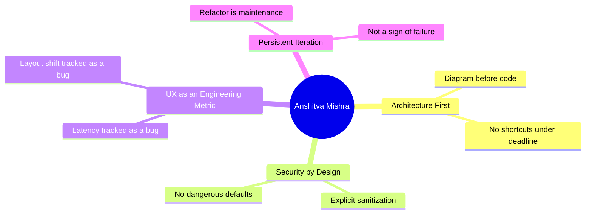
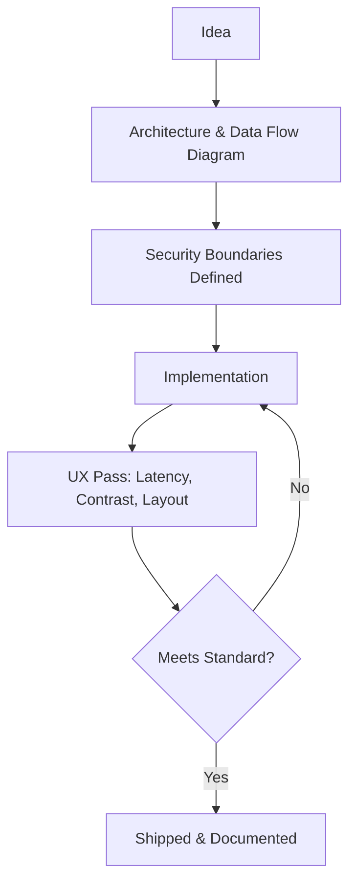
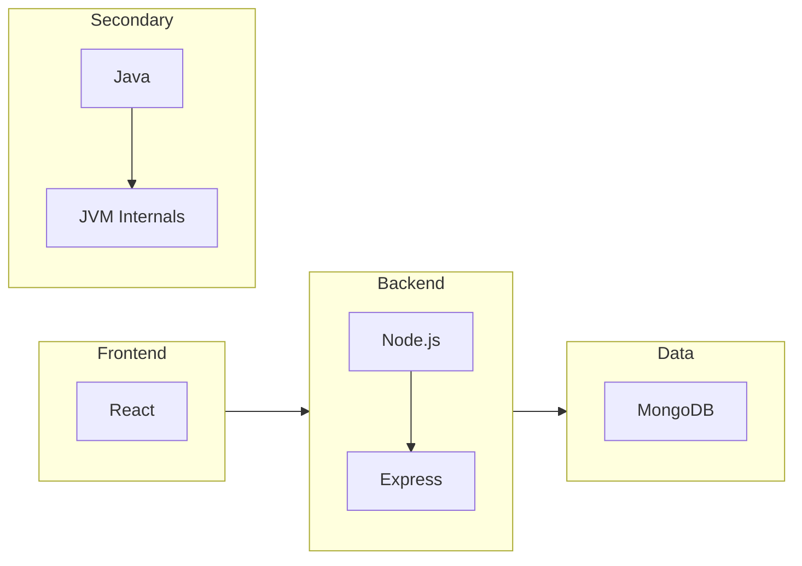
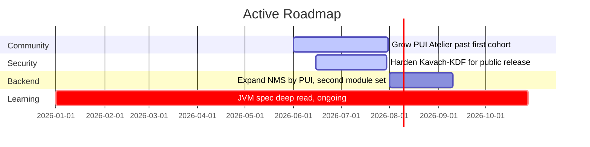

 

---

## About

A full-stack engineer based in Mathura, India, focused on building production-grade software rather than tutorial clones. Every project starts with a diagram before it starts with a `div`. Active since 2024, with 66 repositories shipped and counting.

---

## How I Work

---

## Tech Stack

---

## Shipped Projects

| Project | Status | Summary | Stack |
|---|---|---|---|
| **ProjectUI** | Live | UI component ecosystem with automation modules (AutoProd) and secure utilities (PUICipher) | React, Node.js, MongoDB |
| **PUI Atelier** | Live, ongoing | Selective community of engineers building production-grade, deployable systems only | Community Ops, Code Review |
| **NMS by PUI** | Live, ongoing | 31-module backend masterclass built with Sheryians Coding School and CoderArmy — raw networking, no libraries | Node.js, TCP/IP, Custom Protocols |
| **Java LDP** | Live, ongoing | Deep dive into JVM internals: memory model, class loading, garbage collection | Java, JVM Internals |
| **KhelBuddy.ai** | Archived | First full-stack deployment: an AI productivity suite for writing, image generation, background removal, and resume evaluation | MERN, AI APIs |

All entries link to: [ansh-portfolio-two-flax.vercel.app](https://ansh-portfolio-two-flax.vercel.app)

---

## In Research

| Project | Stage | Summary |
|---|---|---|
| **Norexo** | Research | Anonymous emotional support platform — no identity, no judgment, AI-powered conversation |
| **JVMHub** | Research | Platform for Java developers with an AI mentor, college leaderboards, and a GC-Rank feed algorithm |
| **Kavach-KDF** | Research | Node.js hashing library replacing bcrypt; fixes the 72-byte truncation flaw via HMAC peppering, defaults to Argon2id |

These stay unpublished until the architecture is complete. Shipping unfinished designs is how bad software gets made.

---

## Current Objectives

---

## GitHub Stats

---

## Principles

1. Architecture before code.
2. Pixels deserve respect.
3. Security isn't optional — it's a boundary condition.
4. Every project starts with documentation, not a demo.
5. Deploy less. Think more.
6. A refactor is not a failure. Shipping broken is.

---

## Contact

Open to collaboration on architecture reviews, security audits, or PUI Atelier.

