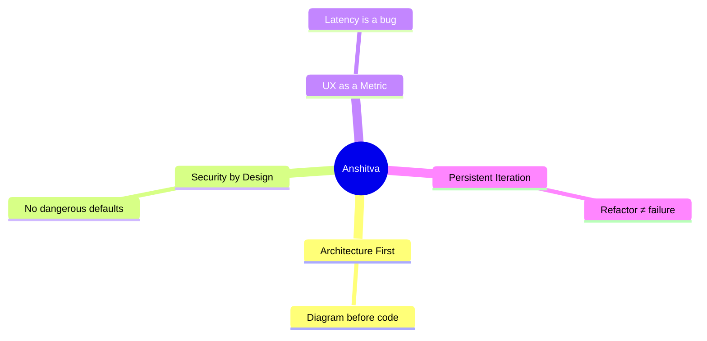
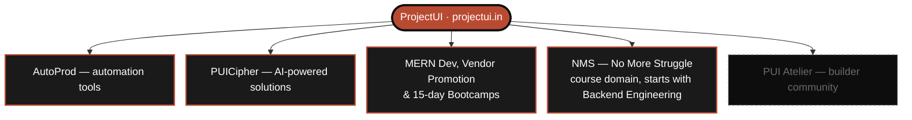
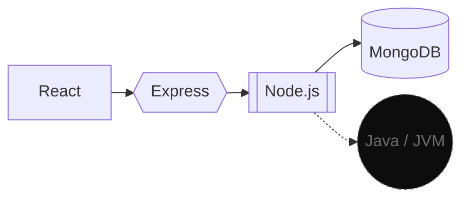
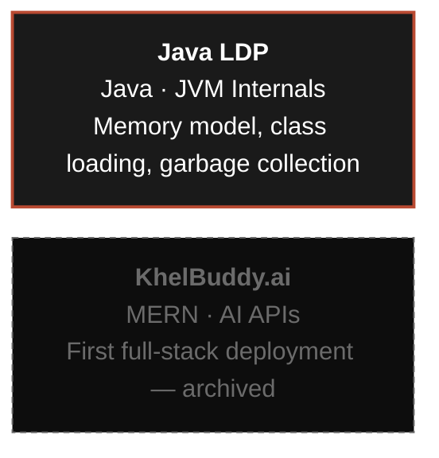
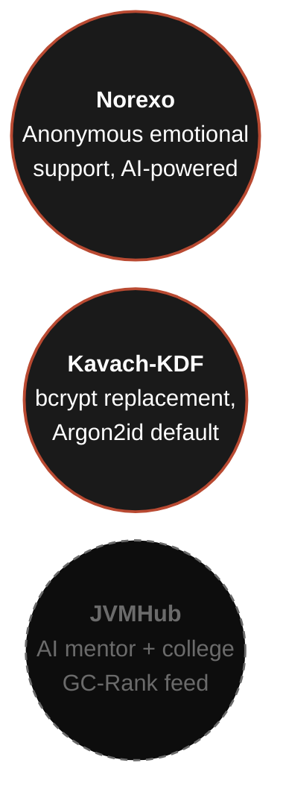
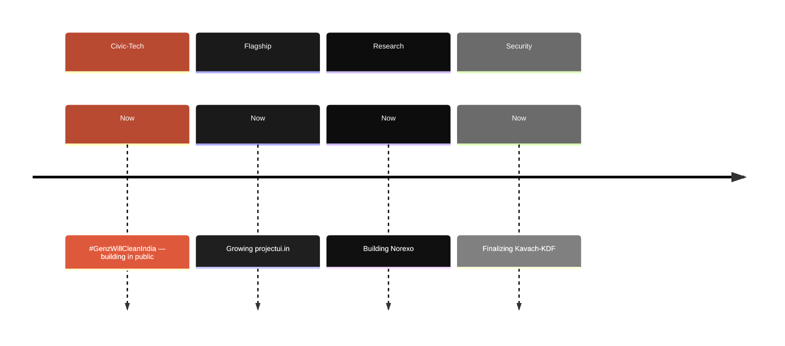

 

 

---

## About

A full-stack engineer based in Mathura, India, focused on building production-grade software rather than tutorial clones. Every project starts with a diagram before it starts with a `div`. Active since 2024, with 66 repositories shipped and counting.

---

## PROJECTUI — the flagship

**[projectui.in](https://projectui.in)** is the umbrella product: a hybrid Automation + AI platform. Everything else here — including PUI Atelier — is a part *of* ProjectUI, not a separate thing.

| Part of ProjectUI | Role |
|---|---|
| **AutoProd** | Automation tools |
| **PUICipher** | AI-powered solutions |
| **MERN Dev & Bootcamps** | Web/app development, free vendor promotion for small vendors, startup growth support, 15-day project bootcamps (MERN + GenAI) |
| **NMS (No More Struggle)** | The course domain — launches with a from-first-principles Backend Engineering masterclass; Fullstack, DSA, GenAI, and ML are on the way |
| **PUI Atelier** | *One* piece — a selective community reviewing code against the same production-grade bar |

---

## How I Build — a storyline

```mermaid
%%{init: {"flowchart": {"nodeSpacing": 14, "rankSpacing": 24, "fontSize": 11, "curve": "basis"}}}%%
flowchart LR
    A(["Think\nsketch + diagram"]):::s1 --> B(["Guard\nsecurity boundaries"]):::s2
    B --> C(["Build\nimplement"]):::s3
    C --> D(["Refine\nlatency · contrast · layout"]):::s4
    D -- "misses the bar" --> C
    D -- "meets the bar" --> E(["Ship\ndocument + deploy"]):::s5

    classDef s1 fill:#0d0d0d,stroke:#B94A32,stroke-width:2px,color:#fff
    classDef s2 fill:#1a1a1a,stroke:#B94A32,stroke-width:2px,color:#fff
    classDef s3 fill:#0d0d0d,stroke:#6B6B6B,stroke-width:2px,color:#fff
    classDef s4 fill:#1a1a1a,stroke:#E8794F,stroke-width:2px,color:#fff
    classDef s5 fill:#B94A32,stroke:#0d0d0d,stroke-width:3px,color:#fff
```

A refactor loop, not a restart — "Refine" only moves forward once it clears the bar.

---

## Tech Stack

---

## Other Shipped Projects

Full portfolio: [ansh-portfolio-two-flax.vercel.app](https://ansh-portfolio-two-flax.vercel.app)

---

## In Research & In Progress 🔒

**Building / In Progress:** Norexo, Kavach-KDF — active work, tracked on the roadmap above.
**Research:** JVMHub — still unpublished until the architecture is complete. Shipping unfinished designs is how bad software gets made.

---

## Current Objectives — 2026

A technology-driven ecosystem for environmental action is now part of the roadmap too — starting with **#GenzWillCleanIndia**, a civic-tech initiative born from seeing Yamunotri Dham buried under pollution, aiming to connect citizens, students, NGOs, and local authorities around river and pollution-hotspot cleanup. Built in public.

---

## GitHub Stats

---

## Principles

1. Architecture before code.
2. Pixels deserve respect.
3. Security isn't optional — it's a boundary condition.
4. Every project starts with documentation, not a demo.
5. Deploy less. Think more.
6. A refactor is not a failure. Shipping broken is.

---

## Contact

Open to collaboration on architecture reviews, security audits, PUI Atelier, or #GenzWillCleanIndia.

